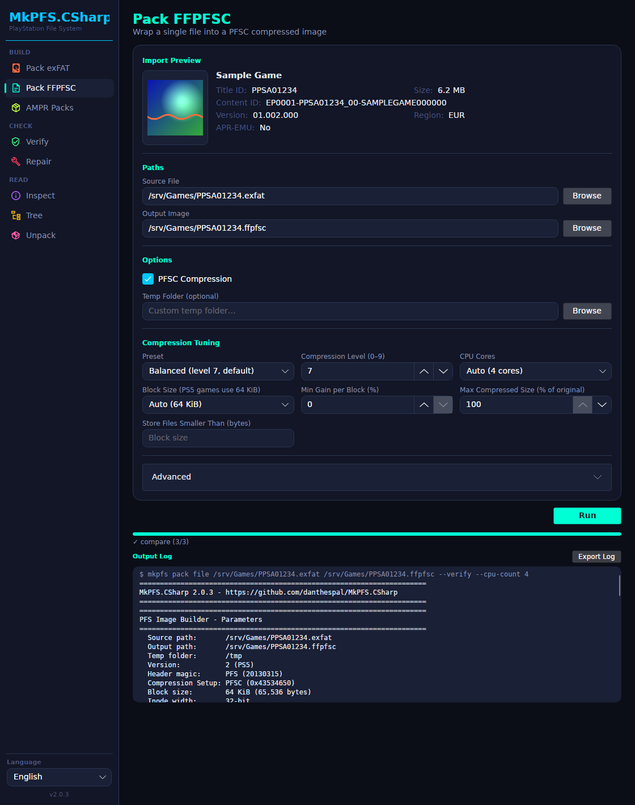
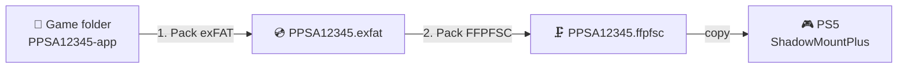
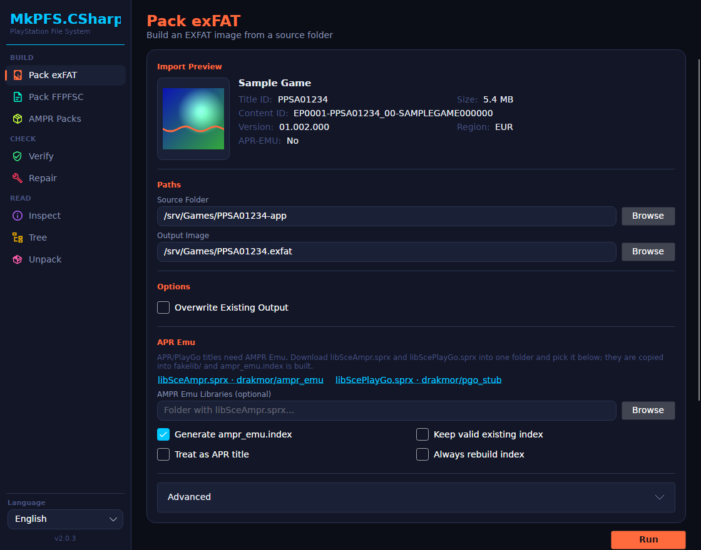
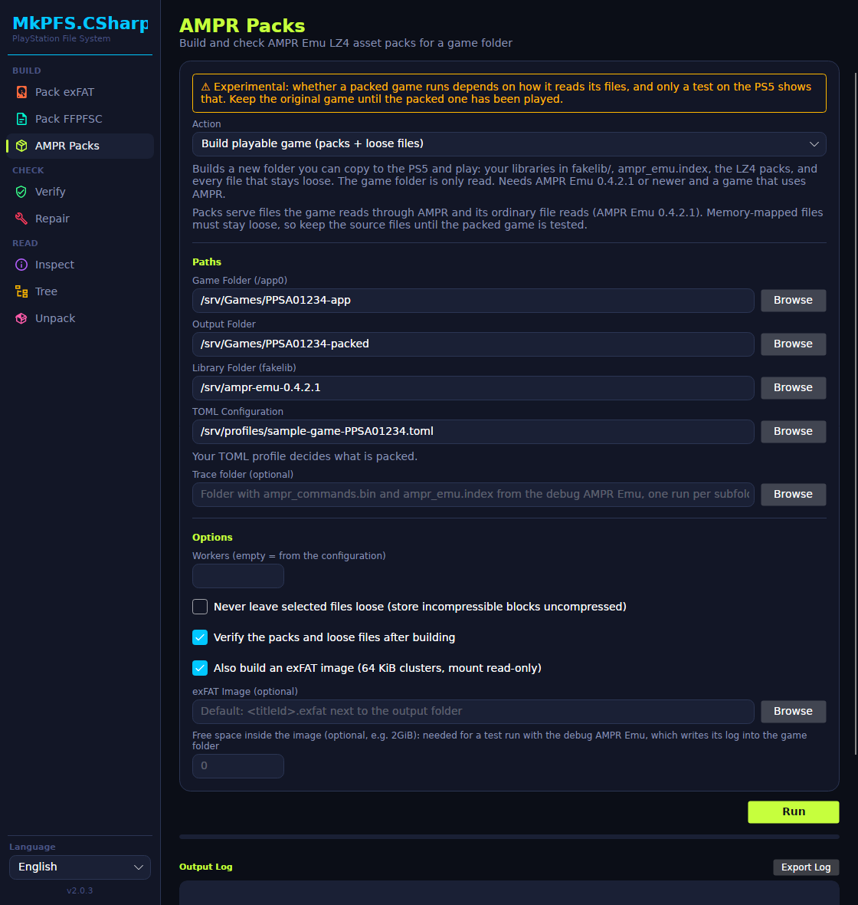
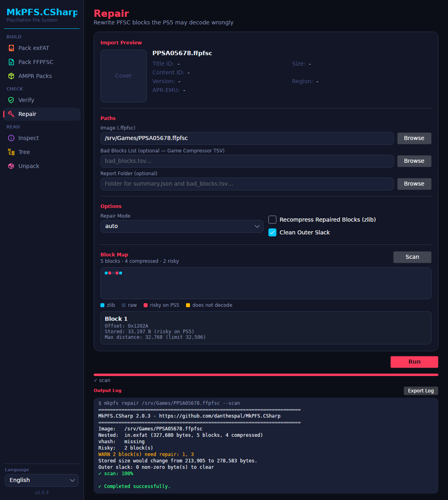
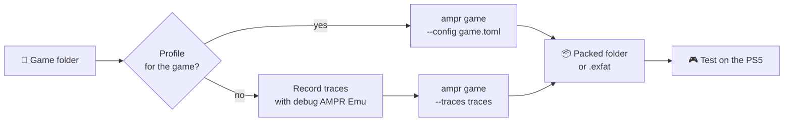

<div align="center">

# MkPFS.CSharp

**Build, check and repair PS4/PS5 game images from the command line or a desktop app.**

[](https://github.com/danthespal/MkPFS.CSharp/actions/workflows/ci.yml)
[](https://github.com/danthespal/MkPFS.CSharp/releases)
[](LICENSE.md)




</div>

MkPFS.CSharp is a .NET 10 port of the Python [MkPFS](https://github.com/PSBrew/MkPFS) by PSBrew. It is a
single native program (no Python needed), writes **the same images** as the original, and adds an offline
PFSC block repair ported from PS5 Game Compressor and LZ4 asset packs for AMPR Emu.

> [!WARNING]
> **AMPR packing (`ampr`, the AMPR Packs page) is experimental.** It can shrink a game a lot, but whether
> the packed game runs depends on how that game reads its files, and only a test on the PS5 shows that.
> Keep the original game until the packed one has been played. See [AMPR asset packs](#ampr-asset-packs).

> [!WARNING]
> **PS5 debug packages (`pack fpkg`, the Pack FPKG page) are experimental.** They match the packages
> [PS5PkgTool](https://github.com/pearlxcore/PS5PKGTool) builds, but neither has been confirmed to install on a
> console yet. Fake packages only start games on **firmware 11.60 and below** (see
> [Console compatibility](#console-compatibility)). See [PS5 debug packages](#ps5-debug-packages).

## Contents

- [Features](#features)
- [Quick start](#quick-start)
- [Console compatibility](#console-compatibility)
- [Download](#download)
- [Desktop app](#desktop-app)
- [Command line](#command-line)
- [APR Emu](#apr-emu)
- [AMPR asset packs](#ampr-asset-packs)
- [PS5 debug packages](#ps5-debug-packages)
- [Differences from Python MkPFS](#differences-from-python-mkpfs)
- [Build from source](#build-from-source)
- [Credits and license](#credits-and-license)

## Features

| | Feature | What it does |
|---|---|---|
| 💿 | **exFAT images** | Turns a game folder into an `.exfat` image (deterministic, 64 KiB clusters). |
| 🗜️ | **FFPFSC images** | Compresses an exFAT image, a game folder or any single file into a `.ffpfsc` (PFSC, zlib). |
| 📁 | **Plain PFS** | Packs a folder as a `.ffpfs` (`--raw`), signed, encrypted, 64-bit inodes or PS4. |
| 📚 | **Batch** | Packs every game folder and image in a folder in one run. |
| 🔍 | **Check** | `verify`, `inspect`, `tree` and `unpack` for PFS, PFSC and exFAT, encrypted ones too. |
| 🩹 | **Repair** | Finds and fixes compressed blocks the PS5 may decode wrongly (images made with ISA-L). |
| 🎮 | **APR Emu** | Copies AMPR Emu into a game's `fakelib/` and writes its `ampr_emu.index`. |
| 📦 | **AMPR packs** *(experimental)* | Packs game data into LZ4 asset packs that AMPR Emu reads on the fly. |
| 🧩 | **PS5 debug packages** *(experimental)* | Builds a fake-signed `.pkg` from a game folder, as PS5PkgTool does, and reads `.pkg` files back. |
| 🖥️ | **Desktop app** | Every command in a window, in English, Português (BR), Español, Română, Deutsch and Français. |

## Quick start

ShadowMountPlus works best with an **exFAT image wrapped in a compressed `.ffpfsc`**. The desktop app
follows the same two steps.



```bash
mkpfs pack exfat PPSA12345-app PPSA12345.exfat     # 1. build the exFAT image
mkpfs pack file PPSA12345.exfat PPSA12345.ffpfsc   # 2. compress it
mkpfs verify PPSA12345.ffpfsc --source-file PPSA12345.exfat   # optional: check it
```

**Which file should I make?**

| Output | Size | Made with | Use it for |
|---|---|---|---|
| `.exfat` | Same as the game | `pack exfat` | The input of `pack file`, or a mount without compression. |
| `.ffpfsc` | Smaller (zlib) | `pack file`, `pack folder` | The usual image for ShadowMountPlus. |
| `.ffpfs` | Same as the game | `pack folder --raw` | Signed, encrypted or PS4 images. |
| AMPR packs | Much smaller (LZ4) | `ampr game` | Experimental: AMPR titles with a tested profile. |
| `.pkg` | Smaller (Kraken) | `pack fpkg` | Experimental: a fake-signed debug package to install. |

## Console compatibility

What each output needs on a jailbroken PS5, and the firmware it works on. These limits come from the
console-side tools and from reports of other tools' output, as of October 2026; MkPFS's own files have not
been tested on every firmware.

| Output | Runs with | Firmware | Notes |
|---|---|---|---|
| `.pkg` (`pack fpkg`) | kstuff-lite, package installer | Starts games on **11.60 and below** | On 11.61, 12.xx and 13.xx the package installs but the game does not start. |
| `.ffpfsc` (`pack folder`, `pack file`) | [ShadowMountPlus](https://github.com/drakmor/ShadowMountPlus) with kstuff-lite 1.07+ | Up to **13.60** | ShadowMountPlus lists PFS images as experimental. |
| `.ffpfs` (`pack folder --raw`) | ShadowMountPlus | Up to 13.60 | Experimental in ShadowMountPlus. |
| `.exfat` (`pack exfat`) | ShadowMountPlus | Up to 13.60 | The compatibility format. |
| AMPR packs (`ampr`) | AMPR Emu in `fakelib/`, through ShadowMountPlus | No published range; as ShadowMountPlus | Not verified. |

- The current public jailbreak covers firmware 7.00 to 13.60 (PS5 and PS5 Pro); 14.00 and newer have none.
- The 11.60 limit of fake packages is in the console's kernel patches (kstuff), not in how a package is built.
  It is expected to rise with a later kstuff release.
- A game built for a newer firmware than the console's needs a backport, whatever the format; MkPFS does not
  backport games.

## Download

Get the archive for your system from the [releases page](https://github.com/danthespal/MkPFS.CSharp/releases)
and unpack it anywhere.

| System | Command line | Desktop app |
|---|---|---|
| Windows x64 | `mkpfs-<version>-win-x64.zip` | `mkpfs-gui-<version>-win-x64.zip` |
| Linux x64 | `mkpfs-<version>-linux-x64.tar.gz` | `mkpfs-gui-<version>-linux-x64.tar.gz` |
| macOS Apple silicon | `mkpfs-<version>-osx-arm64.tar.gz` | `mkpfs-gui-<version>-osx-arm64.tar.gz` |

> [!TIP]
> - Keep each program in its folder with the libraries next to it (`mkpfs_zlib`, plus Skia and HarfBuzz for
>   the desktop app).
> - **macOS:** the desktop app is `MkPFS.CSharp.app`. It is not notarized, so open it the first time with
>   right-click > Open.
> - **Linux:** the desktop app needs X11 and fontconfig, which desktop distributions include.
> - `SHA256SUMS.txt` on the release page lists the checksums. `mkpfs selftest` checks the command line.

## Desktop app

`mkpfs-gui` runs the same commands from a window and shows their output and progress.

<table>
  <tr>
    <td align="center"><br><b>Pack exFAT</b>: game preview and APR Emu</td>
    <td align="center"><br><b>Pack FFPFSC</b>: compression tuning</td>
  </tr>
  <tr>
    <td align="center"><br><b>AMPR Packs</b>: build a playable packed game</td>
    <td align="center"><br><b>Repair</b>: block map of risky blocks</td>
  </tr>
</table>

| Section | Page | What it does |
|---|---|---|
| **Build** | Pack exFAT | Game folder → `.exfat`, with the APR Emu libraries and index. |
| | Pack FFPFSC | `.exfat` (or any file) → compressed `.ffpfsc`. |
| | AMPR Packs | Every `ampr` command; *Build playable game* is the default. |
| **Check** | Verify | Checks an image, optionally against its source. |
| | Repair | Scans an image, draws a block map and repairs risky blocks. |
| **Read** | Inspect, Tree, Unpack | Shows details, lists files and extracts an image. |

- **Game preview:** pick a game folder or image to see its cover, title, IDs, version, region and APR Emu marker.
- **Compression tuning:** presets (Fast, Balanced, Max, Low RAM), the zlib level, block size and keep rules.
  **CPU Cores** offers *Auto*, which uses every physical core (not the logical processors), or any lower count.
- **Tooltips:** hover over any Compression Tuning or Advanced option to see what it does.
- **One progress bar per run:** a run with several steps (pack, then verify and compare) fills one bar,
  and the label names the step, for example `verify (2/3)`.
- **Safe closing:** closing the window during a job asks first; *Stop and Close* waits for the job to clean up.
- `pack folder` and `batch` are available on the command line only.

From a source checkout: `dotnet run --project src/MkPFS.Gui -c Release`.

## Command line

Paths may be absolute or relative. `<...>` is your value, `[...]` is optional, and
`mkpfs <command> --help` shows every option.

| Command | Result | Purpose |
|---|---|---|
| `pack exfat <source_dir> [output]` | `<titleId>.exfat` | Build an uncompressed exFAT image. |
| `pack file <source_file> <image_file>` | `.ffpfsc` | Compress one file (usually an `.exfat`) into a PFS image. |
| `pack folder <source_dir> <image_file>` | `.ffpfsc` | Wrap a folder in exFAT and compress it in one pass. |
| `pack fpkg <source_dir> [output]` | `<content-id>-A<ver>-V0100.pkg` | Build a fake-signed PS5 debug package ([details](#ps5-debug-packages)). |
| `batch <source_dir> <output_dir>` | one `.ffpfsc` per item | Pack many folders and images; existing outputs are skipped. |
| `verify <image_file>` | report | Validate an image, optionally against its source. |
| `inspect <image_file>` | report | Show metadata and integrity information. |
| `tree <image_file>` | file list | List files and folders. |
| `unpack <image_file> <output_dir>` | files | Extract an image. |
| `repair <image_file>` | repaired image | Fix PFSC blocks the PS5 may decode wrongly. |
| `ampr <subcommand>` | JSON | Build and manage AMPR Emu LZ4 asset packs ([details](#ampr-asset-packs)). |
| `selftest` | — | Check that the bundled native libraries load. |

### Examples

```bash
mkpfs pack exfat PPSA12345-app PPSA12345.exfat              # game folder -> exFAT
mkpfs pack file PPSA12345.exfat PPSA12345.ffpfsc            # exFAT -> compressed image
mkpfs pack folder PPSA12345-app PPSA12345.ffpfsc            # both steps in one pass
mkpfs pack folder PPSA12345-app PPSA12345.ffpfs --raw       # plain PFS (signed, encrypted, PS4...)
mkpfs pack fpkg PPSA12345-app --verify                     # fake-signed debug package, checked
mkpfs batch ./games ./output                                # every game in a folder
mkpfs verify PPSA12345.ffpfsc --source-file PPSA12345.exfat # check against the source
mkpfs inspect PPSA12345.ffpfsc                              # details (--format json for scripts)
mkpfs tree PPSA12345.ffpfsc --deep                          # list files inside the wrapped exFAT
mkpfs unpack PPSA12345.ffpfsc out --deep                    # extract the game files
mkpfs repair PPSA12345.ffpfsc                               # fix risky blocks
```

### Exit codes

| Code | Meaning |
|---|---|
| `0` | Success. |
| `1` | The operation failed. |
| `2` | Invalid command line (missing argument, unknown or conflicting options); `ampr` errors also use 2. |
| `3` | `repair --scan` found blocks that need repair. |

### Options of `pack folder` and `pack file`

The defaults are PS5, 32-bit inodes, case-insensitive names, zlib level 7, 64 KiB blocks and compression on.
The output extension is changed to `.ffpfsc` when needed. Single-file and `--raw` builds run a quick
structure check afterwards; the default exFAT-wrapped `pack folder` checks only with `--verify`.

For the default exFAT-wrapped `pack folder`, compression stays on with 64 KiB blocks. Use `--raw` to make
`--no-compress`, `--block-size`, `--inode-bits`, `--max-compressed-ratio`, `--min-compress-size` and
`--skip-executable-compression` take effect.

<details>
<summary><b>Compression options</b></summary>

| Option | Default | Meaning |
|---|---|---|
| `--compress` / `--no-compress` | on | Enable or disable PFSC block compression. |
| `--compression-level <0-9>` | `7` | zlib compression level. |
| `--cpu-count <n>` | `0` (auto) | Compression workers. Auto uses up to 16 and leaves one logical CPU free. |
| `--block-size <bytes\|auto\|auto-fit>` | `auto` (65536) | Power of two from 4096 to 2097152. `auto-fit` reduces padding (folder packing and the spool builder). |
| `--threshold-gain <0-100>` | `0` | Keep a compressed block only when it saves at least this percentage. |
| `--max-compressed-ratio <0-100>` | `100` | Store a file raw when PFSC would exceed this percentage of its size. |
| `--min-compress-size <bytes>` | block size | Store smaller files raw without trying. |
| `--skip-executable-compression` | off | Do not compress important executables. |
| `--compression-backend <...>` | `auto` | Accepted for compatibility; this port always uses zlib 1.3.1. |

</details>

<details>
<summary><b>Image layout and security options</b></summary>

| Option | Default | Meaning |
|---|---|---|
| `--version <PS4\|PS5>` | `PS5` | PFS profile version. |
| `--inode-bits <32\|64>` | `32` | PFS inode width. |
| `--case-sensitive` / `--case-insensitive` | insensitive | Name comparison mode. |
| `--signed` | off | Signed PFS with a zero EKPFS key and seed (not with the exFAT-wrapped `pack folder`). |
| `--encrypted` | off | Encrypt blocks with AES-XTS. |
| `--ekpfs-key <64-hex>` | all zeros | EKPFS key; needs `--encrypted`. |

</details>

<details>
<summary><b>Output, checks and other options</b></summary>

| Option | Default | Meaning |
|---|---|---|
| `--adjust-output-file-extension` / `--no-adjust-output-file-extension` | adjust | Change the extension to match the pack mode, or keep the name as typed. |
| `--temp-folder <dir>` | system temp | Where staged files are written. |
| `--verify` | off | Full verification after packing instead of the quick structure check. |
| `--verify-structure` / `--no-verify-structure` | on | Turn the quick check on or off. |
| `--skip-verification` | off | Skip every post-pack check; not with `--verify`. |
| `--dry-run` | off | Scan and report the layout without writing. |
| `--verbose` | off | Print per-file decisions. |
| `--raw` | off | `pack folder`: write a plain `.ffpfs` instead of the exFAT-wrapped `.ffpfsc`. |
| `--require-game-files` | off | `pack folder`: refuse to pack without `sce_sys/param.json` and `eboot.bin`. |
| `--use-spool` | off | `pack file`: use the older staged builder instead of writing straight into the image. |
| `--rename-inner-image` / `--no-rename-inner-image` | rename | `pack file`: normalize the file name stored inside, or keep it. |

`pack folder` also takes the [APR Emu options](#apr-emu).

</details>

### Options of `pack exfat`

If `output` is omitted, the image is `<titleId>.exfat` next to the source folder; an existing folder as
`output` receives that name.

| Option | Default | Meaning |
|---|---|---|
| `--cluster-size <bytes\|auto>` | `auto` (65536) | exFAT cluster size; 64 KiB suits ShadowMountPlus. |
| `--free-space <size>` | `0` | Free space inside the image, for example `2GiB`. Without it nothing can write to the mounted image. |
| `--overwrite` | off | Replace an existing image. |
| `--verbose` / `--no-progress` | off | More output / no progress bar. |

It also takes the [APR Emu options](#apr-emu).

### Options of `batch`

`batch` finds packable folders and image files in `source_dir` and writes one `.ffpfsc` each into
`output_dir`, skipping existing ones. Its compression, profile, naming and encryption options are the same as
`pack` (`auto-fit` block sizes are not accepted).

| Option | Default | Meaning |
|---|---|---|
| `--overwrite` | off | Replace existing images. |
| `--dry-run` | off | Report the conversions without writing. |
| `--verify` | off | Fully verify each image. |

Folder items also take the [APR Emu options](#apr-emu).

### Reading and extracting

Encrypted images take `--ekpfs-key <64-hex>` (default: all zeros) and `--new-crypt` (alternate key
derivation). PS5 `.pkg` files take `--passcode <32 characters>` (default: all zeros). `verify`, `tree` and `unpack` take `--format <auto|pfs|exfat>`.

| Command | Option | Meaning |
|---|---|---|
| `inspect` | `--format <text\|json>` | Human-readable or JSON report. |
| `tree` | `--deep` | List the files inside a wrapped exFAT. |
| `unpack` | `--deep` | Extract the files inside a wrapped exFAT. |
| | `--only <inner-path>` | With `--deep`, extract only this file or folder (repeatable). |
| | `--overwrite`, `--no-progress` | Replace existing output; hide progress. |
| `verify` | `--source-dir <dir>` / `--source-file <file>` | Compare with the source folder or file (for a `.pkg`, the folder it was built from). |
| | `--expect-crc32 <hex>` | Require this payload CRC32. |
| | `--expect-manifest-sha256 <64-hex>` | Require this manifest SHA-256. |
| | `--require-game-files` | Warn when `sce_sys/param.json`, `eboot.bin` or `pfs-version.dat` is missing. |

### Repair

`repair` works on an unsigned, unencrypted, single-file `.ffpfsc`. It scans for risky compressed blocks,
stores replacements raw, checks their content and cleans unused bytes in the outer PFS.

| Option | Default | Meaning |
|---|---|---|
| `--scan` | off | Report only; exit code 3 when blocks need repair. |
| `--bad-blocks <file>` | none | Repair the blocks listed in a PS5 Game Compressor `bad_blocks.tsv`. |
| `--recompress` | off | Re-encode repaired blocks with zlib level 7 instead of storing them raw. |
| `--mode <auto\|in-place\|copy>` | `auto` | `auto` copies when there is 1.2× the image size free, else rewrites in place. An interrupted `in-place` repair can leave the image corrupt. |
| `--report-dir <dir>` | none | Write `summary.json` and `bad_blocks.tsv`. |
| `--no-slack-cleanup` | off | Leave unused outer bytes unchanged. |
| `--cpu-count <n>` | `0` (all cores) | Workers for scanning and repair. |

## APR Emu

Some PS5 titles use PlayGo/APR and need Drakmor's APR Emu to run from a mounted image: its libraries in the
game's `fakelib/` and an `ampr_emu.index` listing every file. MkPFS does not ship the libraries; download
them into one folder and pass it with `--ampr-libs`.

| Library | Download | Required |
|---|---|---|
| `libSceAmpr.sprx` | [drakmor/ampr_emu](https://github.com/drakmor/ampr_emu/releases) | yes |
| `libScePlayGo.sprx` | [drakmor/pgo_stub](https://github.com/drakmor/pgo_stub/releases) | copied when present |

Before packing a folder, `pack folder`, `pack exfat` and `batch`:

1. With `--ampr-libs`, copy the libraries into `<game>/fakelib/` when the game is an APR title
   (`sce_sys/playgo-chunk.dat` exists) or `--ampr-title` is given. Identical files are left alone.
2. When `fakelib/libSceAmpr.sprx` or `fakelib2/libSceAmpr.sprx` exists, write `ampr_emu.index`, hashed and
   sorted the way the emulator looks paths up, so names with accents resolve on the console.

Both steps change the source folder, so the image includes them.

| Option | Default | Meaning |
|---|---|---|
| `--ampr-libs <dir>` | none | Folder with `libSceAmpr.sprx` (and optionally `libScePlayGo.sprx`). |
| `--ampr-title` | off | With `--ampr-libs`, add the libraries even without `playgo-chunk.dat`. |
| `--no-ampr-index` | off | Do not write `ampr_emu.index`. |
| `--ampr-skip-regen-if-exists` | off | Keep an existing index while it lists exactly the folder's files and sizes. |
| `--ampr-force-regen` | off | Always rebuild the index. |

> [!NOTE]
> - ShadowMountPlus mounts `fakelib2/` instead of `fakelib/` when both exist, so `--ampr-libs` warns and
>   leaves `fakelib2/` for you to update.
> - A folder that also holds AMPR packs (`ampr_assets.index`) keeps its `ampr_emu.index`: the packs address
>   files by their row in it. `--ampr-force-regen` still rebuilds it, which breaks the packs.
> - The desktop app keeps an existing index by default.

## AMPR asset packs

> [!WARNING]
> Experimental. Keep the original, unpacked game until the packed one has been played on the PS5.

### How it works

`ampr` compresses a game's data files (levels, textures, audio, video) with LZ4 into a few pack files
(`ampr_assets-*.pak`) and a manifest (`ampr_assets.index`). On the PS5, Drakmor's
[AMPR Emu](https://github.com/drakmor/ampr_emu) decompresses them on the fly, so the game reads the original
bytes. Executables, modules and `sce_sys` are never packed.


AMPR Emu only serves files that the game reads in ways it intercepts (AMPR reads and ordinary
`open`/`read`/`stat` calls). If a game memory-maps a packed file, or reads it another way, the game usually
crashes. That is why each game needs its own rules, and why only a test on the console proves that a packed
game works.

### Requirements

| Need | Details |
|---|---|
| Console | A jailbroken PS5 with [ShadowMountPlus](https://github.com/drakmor/ShadowMountPlus). |
| Game | An AMPR/APR title (loads `libSceAmpr`). |
| Emulator | AMPR Emu **0.4.2.1 or newer**, the first release that reads packs; older builds are refused. |
| Mount | Read-only (`mount_read_only=1` in ShadowMountPlus, the default). |
| Rules | A **TOML profile** for the game, or **traces** you record yourself. |

### Packing a game



1. Check that the unpacked game runs with AMPR Emu in its `fakelib/`.
2. On the **AMPR Packs** page, choose **Build playable game** and fill in the game folder, a new output folder,
   the folder with AMPR Emu's `libSceAmpr.sprx`, and the game's profile in **TOML Configuration** (or a
   **Trace folder**). Optionally tick **Also build an exFAT image**. On the command line:

   ```bash
   mkpfs ampr game --root PPSA12345-app --output PPSA12345-packed --fakelib ampr-emu --config game.toml --exfat .
   ```

3. Copy the output folder or the `.exfat` image to the PS5. Play past the menu and load a save or a level,
   since some files are only read later.
4. Delete the original only after that.

`ampr game` copies the libraries, writes `ampr_emu.index`, packs, copies the files that stay loose, and checks
that every packed file decodes to the original. The game folder is only read; if a step fails, the output
folder is emptied.

### Making rules from traces

The debug build of AMPR Emu (for example the 0.4.2.1 test-debug-pack) records every file the game reads
through AMPR. MkPFS turns those recordings into rules.

1. Put the debug `libSceAmpr.sprx` into the unpacked game's `fakelib/` and set `mount_read_only=0` for this
   run, so the emulator can write into the game folder.
2. Play a session, then quit the game from the PS5 menu.
3. Copy `ampr_commands.bin` and `ampr_emu.index` into a subfolder of a trace folder (for example
   `traces/session1/`) before starting the game again. Leave both in the game folder: the emulator needs the
   index (keep it unchanged until every session and pack is done), and starts a new journal on each launch.
   More sessions cover more of the game.
4. Put the normal emulator back and set `mount_read_only=1` again.
5. Pick the trace folder in **Trace folder** (`--traces traces`); the page shows how many sessions it found.

Only files a session read are packed. To also pack the other files of the same types (extensions), tick
**Also pack files no session read** (`--pack-untraced-types`), then test the parts of the game they belong to.

To save the rules as a profile you can edit and share:

```bash
mkpfs ampr profile generate \
  --trace traces/session1/ampr_commands.bin traces/session1/ampr_emu.index \
  --trace traces/session2/ampr_commands.bin traces/session2/ampr_emu.index \
  --output game.toml --pack-untraced-types
```

### When a packed game crashes

The normal AMPR Emu writes no log. To find the file that fails:

1. Build again with **Free space inside the image** set to `2GiB` (`--exfat-free-space 2GiB`).
2. Put the debug `libSceAmpr.sprx` into the packed game's `fakelib/`.
3. Mount the image read-write (`image_rw=<image file name>` in ShadowMountPlus's `config.ini`) and start the game.
4. Read `ampr_emu.log` in the image: `apr.pack.open` lines are the packed files the game opened,
   `apr.pack.open.fail` lines the ones it could not open. Keep those loose in the profile.

When you report a game, include its title, ID and version, the profile or traces used, what happened, and for
a crash the ShadowMountPlus log (`/data/shadowmount/debug.log`) and the console log.

### Profile format

Profiles use ampr_emu's TOML format (see its `tools/ampr_pack.example.toml`). Rules are checked in order and
**the last match wins**; `*` also matches `/`.

```toml
[pack]
default_action = "loose"        # files no rule matches stay as they are

[[rule]]
action = "compress"             # LZ4, 64 KiB blocks by default
include = ["data/*"]

[[rule]]
action = "loose"                # always keep executables, modules and system files loose
include = ["eboot.bin", "*.prx", "*.sprx", "sce_sys/*", "sce_module/*", "fakelib/*"]
```

### `ampr` reference

| Subcommand | Required | Purpose |
|---|---|---|
| `game` | `--root --output`, and `--config` or `--traces` | Build a folder that runs from packs as is. |
| `pack` | `--root --ampr-index --output` | Write only the pack set (manifest, volumes, CRC file). |
| `verify` | `--index` | Decode every chunk; `--root` also compares with the source. |
| `unpack` | `--index --output` | Extract packed files (`--file <glob>`, `--overwrite`, `--no-preserve-mtime`). |
| `list` | `--index` | One line per file (`--json` for details). |
| `inspect` | `--index` | Manifest summary, volumes and runtime settings. |
| `runtime-config` | `--index --config` | Replace the runtime settings from a `[runtime]` section without repacking. |
| `remove-sources` | `--index --root` | Show the source files the packs replace; `--confirm` verifies and deletes them. |
| `profile generate` | `--output`, and a session folder or `--trace` | Rules from traces; `--report`, `--metrics`, `--runtime-header`. |
| `profile batch` | `<folder or ZIP> --output-dir` | One profile per trace session and a `summary.json`. |

<details>
<summary><b>Options of <code>ampr game</code> and <code>ampr pack</code></b></summary>

| Option | Default | Meaning |
|---|---|---|
| `--config <toml>` | none | The game's profile. |
| `--traces <folder>` | none | Rules from traces instead of a profile. |
| `--pack-untraced-types` | off | With `--traces`: also pack untraced files of the traced types. |
| `--workers <n>` | min(8, cores) | Compression threads (1 to 256). |
| `--self-contained` | off | Never leave selected files loose; store incompressible blocks uncompressed. |
| `--fakelib <dir>` | none | `game`: AMPR Emu and other libraries to add to `fakelib/`. |
| `--exfat <file or folder>` | none | `game`: also build an exFAT image. |
| `--exfat-free-space <size>` | 0 | `game`: free space inside the image, for a debug run. |
| `--skip-verify` | off | `game`: skip the final checks. |
| `--include`, `--exclude`, `--include-from`, `--exclude-from` | none | `pack`: narrow the rules; `--exclude` forces files loose. |
| `--require-packed <glob>` | none | `pack`: fail if a matching file would stay loose. |
| `--allow-missing` | off | `pack`: leave selected files missing from `--root` loose. |
| `--no-progress` | off | Hide progress. |

</details>

> [!NOTE]
> - `ampr pack` and `ampr profile` are ports of ampr_emu's `tools/ampr_pack.py` (4.0) and
>   `tools/ampr_pack_profile.py` (4.1), with the same output byte for byte. `game`, `--traces` and
>   `--pack-untraced-types` are MkPFS additions.
> - The release emulator loads at most 2,000,000 files, 16,000,000 chunks and 1,024 volumes; `pack` warns
>   when a set goes over a limit.
> - Deploy `ampr_emu.index`, the manifest, its `.runtime` file and every volume from the same build. The
>   `.crc` file is only used by `verify` and `unpack`.
> - Use an exFAT image or the plain folder, not `.ffpfsc`: zlib on top of LZ4 makes loading slower.

## PS5 debug packages

`pack fpkg` builds a fake-signed PS5 debug package (`.pkg`) from a game or homebrew folder for a console that
installs debug packages. It produces the same packages as [PS5PkgTool](https://github.com/pearlxcore/PS5PKGTool):
with `--compression stored` the bytes match PS5PkgTool's except the random RSA padding of the key entries;
with `auto` (the default) the layout and every compress-or-store decision match, but the Kraken streams differ.
Memory use stays small whatever the size of the game; packages over 4 GiB and with thousands of files work.
Fake packages start games only on firmware 11.60 and below; see [Console compatibility](#console-compatibility).

The folder needs `eboot.bin` at its root and should have `sce_sys/param.json` (the content id comes from it).
`pack fpkg` then:

- fake-signs plain ELF modules (`eboot.bin`, `*.elf`, `*.prx`, `*.sprx`) in the package, never in the folder;
- adds `sce_sys/keystone` (from the passcode), `sce_sys/pfs-version.dat` and `sce_sys/about/right.sprx`;
- moves `param.json`, the icons and pictures (with their `.dds` versions) and `changeinfo/` into the package
  header, packs everything else into the game file system;
- refuses file names with non-ASCII characters (PS5PkgTool turns them into `?`).

```bash
mkpfs pack fpkg PPSA12345-app                          # UP0000-PPSA12345_00-...-A0100-V0100.pkg here
mkpfs pack fpkg PPSA12345-app game.pkg --compression stored --verify
mkpfs pack fpkg homebrew --content-id UP0000-TEST00000_00-HOMEBREW00000000 --title "My App"
mkpfs verify game.pkg --source-dir PPSA12345-app       # every digest, then compare with the folder
mkpfs unpack game.pkg out                              # extract the game files
```

| Option | Default | Meaning |
|---|---|---|
| `--content-id <id>` | `contentId` of `param.json` | 36-character content id; required when the folder has no `param.json`. |
| `--passcode <32 chars>` | all zeros | The package key is derived from it. |
| `--compression <auto\|fast\|stored>` | `auto` | Kraken where it pays; `fast` uses a quicker parse (about twice as fast, a few percent larger); `stored` does not compress. |
| `--cpu-count <n>` | `0` (auto) | Kraken workers. Auto uses every logical processor (the encoder gains from hyper-threading); the package is the same whatever the count. |
| `--verify` | off | Check the finished package and compare it with the folder. |
| `--dry-run` | off | Check the folder and report what would be packed. |
| `--no-fake-sign` | off | Pack plain ELF modules unchanged (a debug-mode console only starts fake-signed ones). |
| `--seed <32 hex>` | from content id and passcode | Outer image seed; the same folder and options always give the same package. |
| `--timestamp <unix>` | `SOURCE_DATE_EPOCH` or now | Time stamped on every file. |
| `--title`, `--app-version`, `--drm-type` | title id, `01.00`, `free` | Used only to generate a missing `param.json`; a supplied one is packed unchanged. |
| `--temp-folder <dir>` | next to the package | Where the inner image is staged while building; it is about as large as the game. |
| `--verbose` | off | Log every file's placement and compression and the package layout. |
| `--json` | off | Print the result as JSON. |

## Differences from Python MkPFS

| Area | MkPFS.CSharp |
|---|---|
| Output | The same images as Python MkPFS 1.0.0 with its zlib backend. Set `SOURCE_DATE_EPOCH` for reproducible timestamps. |
| Compression | Always zlib 1.3.1 (level 7 by default). `--compression-backend` is ignored: ISA-L output uses back-references the PS5 decodes wrongly. |
| New commands | `repair` and `ampr`. |
| APR Emu | `pack exfat` and `batch` also build `ampr_emu.index`; `--ampr-libs` and `--ampr-title` are new; `--ampr-skip-regen-if-exists` checks every path and size. |
| `ampr_emu.index` | Matches ampr_emu and the console lookup, so files with non-ASCII names are found; skips the emulator's own trace and log files; `fakelib2/` also counts. |
| Fixed bugs | Listed in [tools/oracle/README.md](tools/oracle/README.md). |

Switching from Python MkPFS? See [MIGRATION.md](MIGRATION.md).

## Build from source

| Requirement | Details |
|---|---|
| .NET SDK | 10.0.401 or a newer 10.0.4xx (see `global.json`). |
| Windows | Visual Studio 2026 with *Desktop development with C++* (native zlib and Native AOT). |
| Linux, macOS | CMake and a C compiler; Linux Native AOT also needs `clang` and `zlib1g-dev`. |

```bash
dotnet build MkPFS.slnx                                # the first build compiles zlib and lz4 in native/
dotnet test --solution MkPFS.slnx                      # parity tests skip without the oracle corpus
dotnet publish src/MkPFS.Cli -r win-x64 -c Release     # native command line
dotnet publish src/MkPFS.Gui -r win-x64 -c Release     # native desktop app
```

Use `linux-x64` or `osx-arm64` on those systems. On Windows, Native AOT linking needs the Visual Studio
Installer folder (`C:\Program Files (x86)\Microsoft Visual Studio\Installer`) on `PATH`.

### Project layout

| Path | Content |
|---|---|
| `src/MkPFS.Core` | Formats and codecs: PFS, PFSC, exFAT, AMPR, crypto, readers, validators. |
| `src/MkPFS.Build` | Image builders, compression planner, batch, AMPR packer. |
| `src/MkPFS.Repair` | PFSC repair (Game Compressor port). |
| `src/MkPFS.Cli` | The `mkpfs` command line. |
| `src/MkPFS.Gui` | The `mkpfs-gui` desktop app (Avalonia). |
| `native/` | zlib 1.3.1, lz4 1.9.4 and the `mkpfs_zlib` shim. |
| `tests/` | Unit tests, byte-for-byte parity tests and headless GUI tests. |
| `tools/oracle` | Python oracle scripts ([README](tools/oracle/README.md)). |

### Oracle corpus

The parity tests compare against images and logs made by the Python tools. See
[tools/oracle/README.md](tools/oracle/README.md) for setup.

```bash
uv run --project ../MkPFS python tools/oracle/build_goldens.py --check        # Python MkPFS
python tools/oracle/build_ampr_goldens.py --check                             # ampr_emu ampr_pack.py
uv run --no-project --python 3.12 --with lz4==4.4.5 python tools/oracle/check_ampr_profile.py
```

### Releases

Push a version tag (`git tag v2.0.0` then `git push origin v2.0.0`). The release workflow reruns CI, uploads
the archives, `SHA256SUMS.txt` and release notes, and marks the release as latest. With a `VT_API_KEY`
repository secret (a VirusTotal API key) it also scans every archive and links the reports.

## Credits and license

| Project | Used for |
|---|---|
| [MkPFS](https://github.com/PSBrew/MkPFS) by PSBrew | The Python original this port follows. |
| PS5 Game Compressor by Juma Sayeh | The PFSC repair logic. |
| [APR Emu](https://github.com/drakmor/ampr_emu) by Drakmor | `ampr_emu.index` and the asset-pack format and tools that `ampr` ports. |
| [PlayGo stub](https://github.com/drakmor/pgo_stub) by Drakmor | `libScePlayGo.sprx`. |
| [LibProsperoPKG](https://github.com/SvenGDK/LibProsperoPKG) by SvenGDK (GPL-3.0-or-later) | PS5 package research; parts of the PS5 package builder, the Kraken encoder and the Kraken decoder are ported from it (the decoder derives from [ooz](https://github.com/powzix/ooz) by Powzix, GPL-3.0). |
| [PS5PkgTool](https://github.com/pearlxcore/PS5PKGTool) by pearlxcore (GPL-3.0) | The package format `pack fpkg` reproduces, checked against its output (its engine is used as a black box, not copied). |

Third-party components: [zlib](https://zlib.net) 1.3.1 (zlib license), [LZ4](https://github.com/lz4/lz4)
1.9.4 and [Tomlyn](https://github.com/xoofx/Tomlyn) (BSD-2-Clause), [Avalonia](https://avaloniaui.net),
[CommunityToolkit.Mvvm](https://github.com/CommunityToolkit/dotnet),
[System.CommandLine](https://github.com/dotnet/command-line-api) and [Spectre.Console](https://spectreconsole.net)
(MIT), and [Material Design Icons](https://pictogrammers.com/library/mdi/) (Apache-2.0).

`pack fpkg` embeds Sony's `sce_sys/about/right.sprx`, which every debug package carries (PS5PkgTool ships the
same file).

Licensed under **GPL-3.0-only**, like MkPFS; see [LICENSE.md](LICENSE.md). This project is not affiliated with
Sony Interactive Entertainment.
